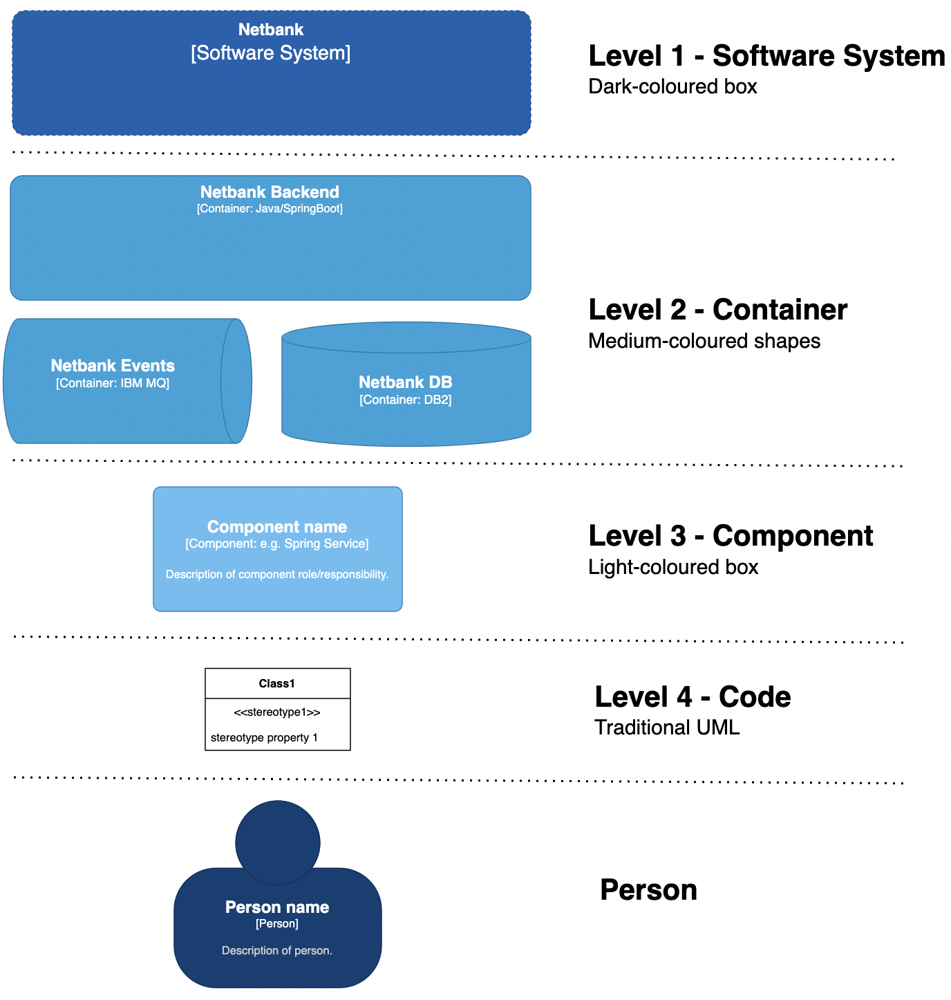
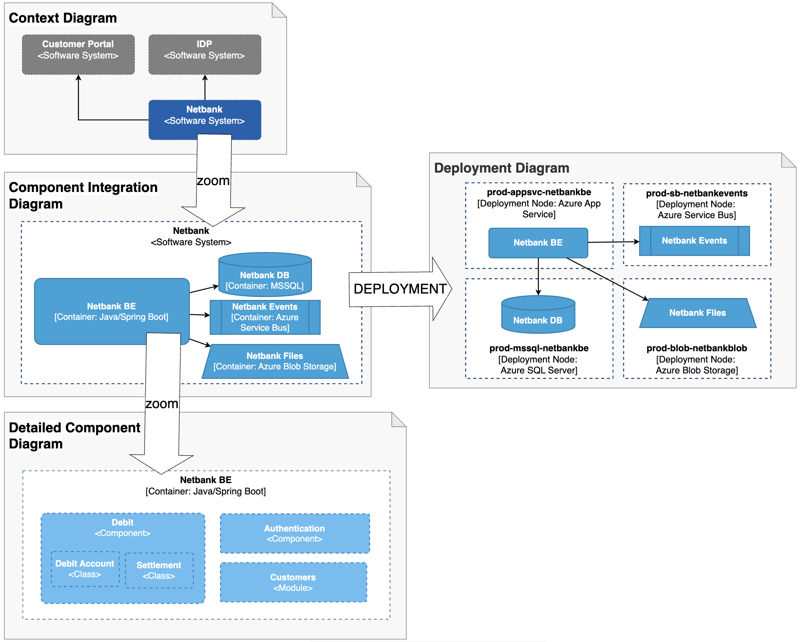

# The C4 model

This page is in full attributed to the original author of the C4-model, Simon Brown. It is a brief recap of the C4-model in a format that complies with the approach in this material. All formulations are copied and remixed from the original text from [the C4 Model](https://c4model.com).

## Core concepts

A software system is made up of one or more containers (applications and data stores), each of which contains one or more components, which in turn are implemented by one or more code elements (classes, interfaces, objects, functions, etc). And people may use the software systems that we build.

More formally, we can define it as this:

- **Software System**: A **Software System** is the highest level of abstraction and describes something that delivers value to its users, whether they are human or not. This includes the software system you are modelling, and the other software systems upon which your software system depends (or vice versa). In many cases, a software system is "owned by" a single software development team.
- **Container**: a **Container** represents an application or a data store. A container is something that needs to be running in order for the overall software system to work.
- **Component**: A **component** is a grouping of related functionality encapsulated behind a well-defined interface. All components inside a container typically execute in the same process space. Hence, components are NOT separately deployable units.
- **Person**: A **Person** represents one of the human users of your software system (e.g. actors, roles, personas, etc).

## Relationships between the concepts

By putting together the definitions from the previous section we can rephrase it with an emphasis on the relationships between the concepts.

- A Software System is **composed** of Containers
- A Container is **composed** of Components.
- A Component is **composed** of Code Elements
- A Person **uses** your system.

The following diagram depicts the relationships between the core concepts using one-to-many relationships "--<" and many-to-many relationships ">--<".

```
                            usage
        Software System  >---------<  Person
             |
composition  |
            / \
          Container
             |
composition  |
            / \
          Component
             |
composition  |
            / \
        Code Element
```

It is worth noticing the following:

- The concepts of Software System, Container, Component and Code Element makes up a set of _hierarchical abstractions_. Alternatively you can say that Software System, Container, Component and Code Element makes up a tree-structure.

Another way to depict the above is shown here:


## Notation

The C4-model is notation-agnostic in theory. It is clearly stated on [the C4 Model](https://c4model.com) that the focus of the model is on the concepts and that notation can be selected freely.

In reality, the notation of C4 in many organizations follows the conventions established on [the C4 Model website](https://c4model.com) which is summarized here:



The following provides some realistic examples of how the notation can be applied in different kinds of diagrams. It should be clear how one can zoom in and out of various details.



## Elaboration of core concepts

In real terms, a Container is something like:

- Server-side web application: A Java EE web application running on Apache Tomcat, an ASP.NET MVC application running on Microsoft IIS, a Ruby on Rails application running on WEBrick, a Node.js application, etc.
- Client-side web application: A JavaScript application running in a web browser using Angular, Backbone.JS, jQuery, etc.
- Client-side desktop application: A Windows desktop application written using WPF, an OS X desktop application written using Objective-C, a cross-platform desktop application written using JavaFX, etc.
- Mobile app: An Apple iOS app, an Android app, a Microsoft Windows Phone app, etc.
- Server-side console application: A standalone (e.g. "public static void main") application, a batch process, etc.
- Serverless function: A single serverless function (e.g. Amazon Lambda, Azure Function, etc).
- Database: A schema or database in a relational database management system, document store, graph database, etc such as MySQL, Microsoft SQL Server, - - Oracle Database, MongoDB, Riak, Cassandra, Neo4j, etc.
- Blob or content store: A blob store (e.g. Amazon S3, Microsoft Azure Blob Storage, etc) or content delivery network (e.g. Akamai, Amazon CloudFront, etc).
- File system: A full local file system or a portion of a larger networked file system (e.g. SAN, NAS, etc).
- Shell script: A single shell script written in Bash, etc.
  etc

A Container is essentially a context or boundary inside which some code is executed or some data is stored. And each container is a separately deployable/runnable thing or runtime environment, typically (but not always) running in its own process space. Because of this, communication between containers typically takes the form of an inter-process communication.

If you're using a language like Java or C#, the simplest way to think of a Component is that it's a collection of implementation classes behind an interface. Aspects such as how those components are packaged (e.g. one component vs many components per JAR file, DLL, shared library, etc) is a separate and orthogonal concern.
