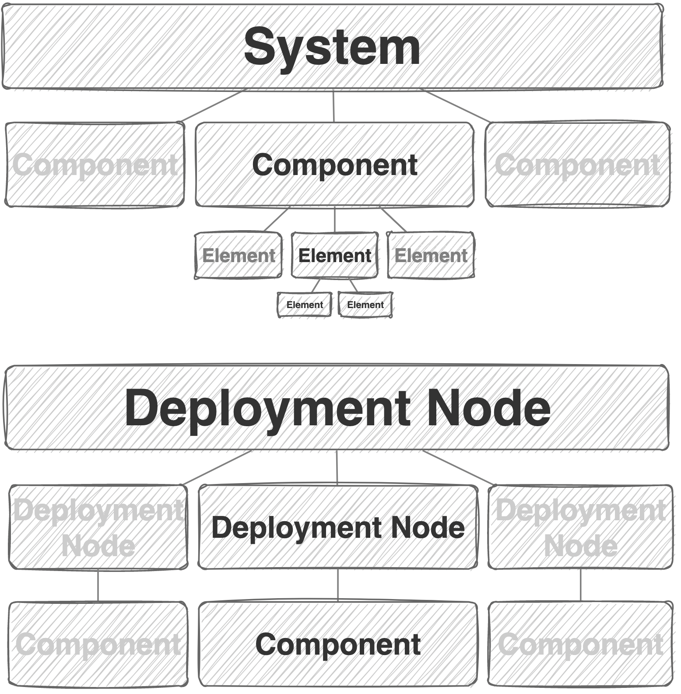
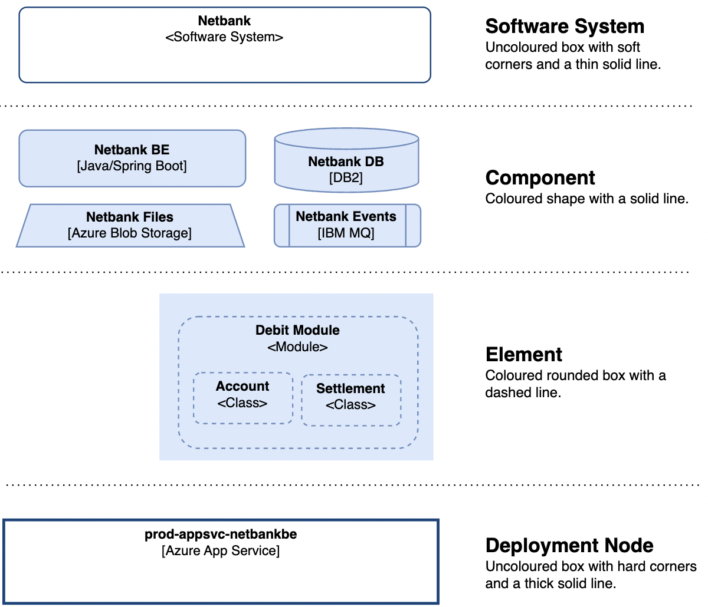
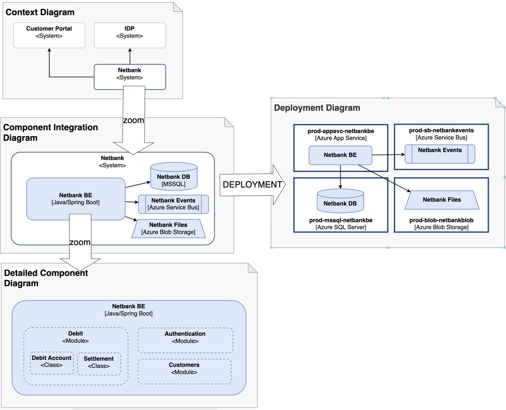

# The C5 model

## Core Concepts

In this section, we will Capitalize the Concepts to be defined, we will use **bold** to designate the point of definition and we will use _italic_ when we assume some a priori knowledge of the reader. If the a priori knowledge is not well understood, we refer to the FAQ section.

- **Component**: A **Component** is a _deployable unit of software_.

- **System**: A **System** is a set of Components that together constitutes a _coherent whole_.

- **Elements**: An **Element** is an _inner part_ of a Component or of another Element.

- **Deployment Node**: A **Deployment Node** is a _runtime container_ for a Component or for another Deployment Node. When all Components within a System are deployed in Deployment Nodes, the use cases of the System can be realized.

## Relationships between the concepts

By putting together the definitions from the previous section we can rephrase it with an emphasis on the relationships between the concepts.

- A System is **composed** of Components
- A Component is **composed** of Elements.
- A Component is **deployed** on a Deployment Node

The following diagram depicts the relationships between the core concepts using one-to-many relationships "--<" and many-to-many relationships ">--<".

```
System
   |
   |composition
  / \
Component >----< Deployment Node --|
   |    deployment       \ /       |
   |                      |________|
   |composition          composition
  / \
Element --|
  \ /     |composition
   |______|

```

Another way to depict the above is shown here:



It is worth noticing the following:

- The concepts of System, Component and Element makes up a set of _hierarchical abstractions_. Alternatively you can say that System, Component and Elements makes up a tree-structure.
- The structure of System, Component and Element should follow the MECE principle, meaning that Components should be Mutually Exclusive and Collectively Exhaustive of a System. The same apply for Elements within a Component and for Elements within an Element. We can borrow the mathematical notion of "partition" and say that System-Component-Element makes up a partitioning structure.

## Notation

The proposed notation is depicted here:



The following provides some realistic examples of how the notation can be applied in different kinds of diagrams. It should be clear how one can zoom in and out of various details.



# Appendix

## Frequently Asked Questions

Q: Why have we selected only four Core Concepts and how can we expect it to provide a vocabolary rich enough to reason about software architecture?

A: A key idea of the C5 model is that we need a solid foundation for the rest to build on. Hence, there are plenty of other necessary notions such as "solution", "application", "product" and "service", all of which brings important nuances to a discussion in a specific context. However, the more concepts we include in the model, the less are the chances that it will resonate fully. If even a single concept is not resonating well with people inside an organization, the model will be harder to adopt.

Q: Why is Code Elements not included as a Core Concept?

A: The notion of Code Elements (Classes, types etc.) are of course very important. However, Code Elements are in fact to be of a different kind than the notions of components, systems and deployment nodes and for this reason it is not part of the core concepts of the C5 model.

Q: The model provides a couple of realistic example diagrams. Why is the model not providing a complete standard for diagrams types such as Context Diagram, Integration Diagram etc?

A: Creating a standard for architecture diagrams may be important on its own right. Such a standard should establish a set of standard diagrams each having a specific standard name together with a declaration of what concepts and relationships are in focus. Although such a standard for diagrams is very valuable, it is for now an extension that people needs to build on top of the model.

Q: Why do we need the System concept? Why do we need a higher-level structure on top of components? The notion of Components is useful, tangible and easily understandable, the notion of System is not.

A: It is true that the notion of System is harder to comprehend than the notion of component. Furthermore, it is not always clear whether we need it at all. In particular, on a simple software platform with few components, it may suffice to deal with components without ever considering any higher level structure. As things grow and you need a larger organization around a software platform, the need to collect Components in natural groups will emerge.

## Elaboration of the core concepts

### More about the System concept

The idea of a Software System can be hard to comprehend because it is rather abstract and to some may seem unnecessary.
Some would say that we don't need any other concept that

### More about the Component concept

The Component concept is one of the most difficult concepts to establish because it is

The relationship between the constituted by one or more distinct and non-overlapping **components** which are tangible parts of the code-base with clear boundaries. A **system** is the highest level of abstraction and describes something that delivers value to its users, whether they are human or not. Systems provides a strong organising factor in enterprises. Often teams, departments or business units are organized around the system landscape as well as access control and service-ownership.

Each components can be separately deployed into a running state and when all components are deployed they will interact in ways that realize the use-cases of the system.

The set of all Sub-Components within a Component should constitute a partition of the Component.
